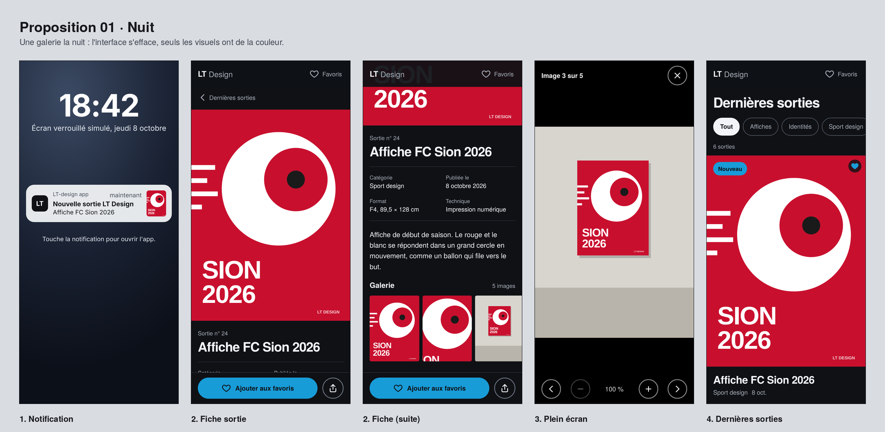
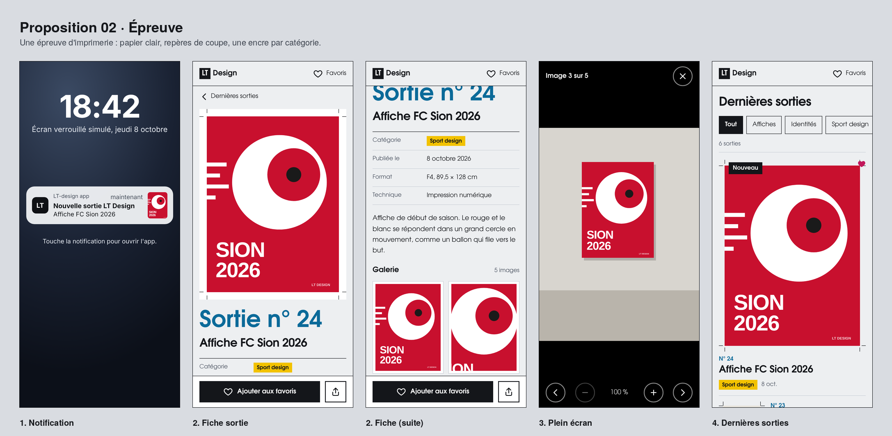
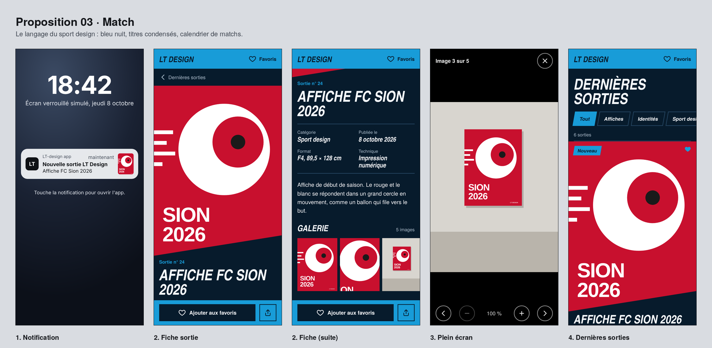

# Critique comparative · 3 propositions de design pour LT-design app

Les trois propositions générées avec l'IA ([01 · Nuit](propositions/01-nuit/), [02 · Épreuve](propositions/02-epreuve/), [03 · Match](propositions/03-match/)) sont évaluées par rapport au [brief](../../brief.md), au [persona](persona.md) et au [user flow](user-flow.md). Chaque prototype a été ouvert dans Chromium à **390 × 844 px** (largeur de référence du brief), parcouru du début à la fin du flow, puis mesuré : place du visuel, longueur des pages, poids des polices, contrastes et navigation au clavier.

Les trois propositions partagent la même structure HTML et le même JavaScript : seules les feuilles de style changent. Leurs résultats d'accessibilité sont donc identiques (voir [tests-utilisateurs.md](tests-utilisateurs.md)), et la comparaison porte sur la direction visuelle et sur la façon dont chacune répond à Benjamin.

## Les trois propositions

---

## Verdict en bref

| | 01 · Nuit | 02 · Épreuve | 03 · Match |
|---|:---:|:---:|:---:|
| Respect du brief (ambiance, bleu en accent) | 5/5 | 2/5 | 2/5 |
| Réponse au persona (visuel d'abord, zoom, partage) | 4/5 | 3/5 | 3/5 |
| Hiérarchie et lisibilité | 4/5 | 4/5 | 2/5 |
| Mise en valeur des visuels de LT Design | 5/5 | 4/5 | 2/5 |
| Caractère et identité | 3/5 | 5/5 | 4/5 |
| Accessibilité et légèreté (mesurées) | 5/5 | 4/5 | 4/5 |
| **Total** | **26/30** | **22/30** | **17/30** |

**Proposition retenue : 01 · Nuit.** C'est la seule qui respecte l'ambiance du brief, celle qui montre les visuels le plus grand et la plus légère. Son point faible, un caractère discret, se corrige en reprenant deux idées d'Épreuve (voir la [recommandation](#proposition-retenue--01--nuit)).

---

## Comparatif mesuré (390 × 844 px)

| Point | 01 · Nuit | 02 · Épreuve | 03 · Match |
|---|---|---|---|
| Part du premier écran de la fiche occupée par le visuel | **62 %** | 55 % | 62 %, mais le bas est coupé |
| Titre de la fiche visible sans défiler | oui, 1 ligne | oui, 1 ligne | oui, 2 lignes |
| Hauteur totale de la fiche | **1325 px** | 1895 px | 1390 px |
| Hauteur totale de l'accueil | 1871 px | 1722 px | **1482 px** |
| Largeur des vignettes dans la liste | **173 px** | 112 px | 60 px |
| Titres sur 2 lignes ou plus dans la liste (sur 6) | 3 | **1** | 4 |
| Catégorie repérable d'un coup d'œil | texte gris | **étiquette de couleur + nom** | texte gris |
| Polices chargées | **263 Ko (2 fichiers)** | 338 Ko (2 fichiers) | 398 Ko (3 fichiers) |
| Contraste de texte le plus faible | **6,11:1** | 5,15:1 | 5,64:1 |
| Débordement horizontal à 390 px | non | non | non |
| Erreurs JavaScript | 0 | 0 | 0 |

Les trois propositions passent les mêmes contrôles d'accessibilité : tous les textes au-dessus de 4,5:1, le parcours complet faisable au clavier (16 étapes sur 16) et toutes les cibles tactiles d'au moins 44 px.

---

## 01 · Nuit

**Intention :** une galerie la nuit. L'interface s'efface, seuls les visuels ont de la couleur. Le bleu LT Design ne sert qu'au badge « Nouveau », au focus clavier et au bouton « Ajouter aux favoris ».

**Points forts**
- La seule qui suit le brief à la lettre. Comme le bleu est rare, le badge « Nouveau » et le bouton favori sont les premières choses que l'œil trouve.
- Les affiches de LT Design sont les seules couleurs à l'écran : rien ne leur fait concurrence, comme sur le mur d'une galerie.
- Grille à 2 colonnes sur l'accueil, avec les plus grandes vignettes des trois (173 px). Benjamin reconnaît une affiche à son visuel avant même de lire le titre.
- La fiche la plus courte (1325 px). Le visuel prend 62 % du premier écran et le titre reste visible juste en dessous.
- Le meilleur contraste (6,11:1 au minimum) et les polices les plus légères (263 Ko).

**Points faibles**
- La moins originale : un fond presque noir avec un seul accent est une formule fréquente. Le caractère vient des visuels, pas de l'interface. Sans les vrais projets de LT Design, l'app paraît vide.
- Les catégories sont écrites en gris, sans forme : on ne distingue pas d'un coup d'œil une affiche d'une identité.
- 3 titres sur 6 passent sur 2 lignes dans la grille à 2 colonnes.
- Les bordures des filtres et du bouton Partager étaient trop faibles au départ (1,45:1). Elles ont été corrigées à 3,99:1 (voir [tests-utilisateurs.md](tests-utilisateurs.md)).

**Ressenti :** calme et efficace. Elle fait exactement ce que Benjamin attend en arrivant de la notification : voir l'affiche en grand, tout de suite.

---

## 02 · Épreuve

**Intention :** l'app comme une épreuve d'imprimerie. Papier clair, repères de coupe autour des visuels, sorties numérotées dans l'ordre de parution et une encre par catégorie.

**Points forts**
- La plus ancrée dans le métier de LT Design : repères de coupe, numéros d'édition et fiche technique (format, technique) présentée comme un bon à tirer. Elle parle directement à un fan de graphisme.
- Les catégories se repèrent immédiatement : une encre par catégorie (cyan pour les affiches, magenta pour les identités, jaune pour le sport design), toujours avec son nom écrit.
- La fiche technique en lignes est la plus facile à lire des trois.
- La galerie en grille montre de grandes vignettes, sans défilement horizontal.

**Points faibles**
- Elle va contre le brief : fond clair au lieu de sombre, et trois encres en plus du bleu, qui n'est plus le seul accent.
- **Hiérarchie inversée sur la fiche** : « Sortie n° 24 » en 56 px est plus visible que le nom du projet. Benjamin cherche « Affiche FC Sion 2026 », pas un numéro.
- Le visuel prend moins de place (55 % du premier écran) à cause du cadre de papier et des repères.
- La fiche la plus longue : 1895 px, soit 43 % de plus que Nuit, à cause de la galerie en grille.
- Les repères de coupe mesurent 10 px. Sur un téléphone, ils deviennent un détail que presque personne ne remarque.
- Adventor est une police large qui prend de la place, et les polices pèsent 338 Ko.

**Ressenti :** la plus personnelle et la plus juste pour un graphiste, mais elle met en avant le cadre plutôt que l'affiche.

---

## 03 · Match

**Intention :** le langage du sport design. Bleu nuit de stade, titres condensés en italique, sorties listées comme un calendrier de matchs, visuels coupés en diagonale.

**Points forts**
- La plus énergique. Elle parle tout de suite du sport design, une des spécialités de LT Design.
- L'accueil le plus compact (1482 px) : la liste en calendrier, avec la date en grand, se parcourt très vite.
- La coupe en diagonale est un geste fort et facile à retenir.

**Points faibles**
- **La coupe en diagonale cache le bas de chaque visuel.** Sur l'affiche FC Sion, la signature « LT DESIGN » disparaît, sur la fiche comme sur l'accueil. Pour une app qui montre le travail d'un graphiste, couper ses affiches est le défaut le plus grave des trois propositions.
- Elle impose l'univers du sport à toutes les sorties, alors que la moitié des projets n'en sont pas (Brume Café, Atelier Vire, Les Échos).
- Les majuscules condensées en italique se lisent moins bien : 4 titres sur 6 passent sur 2 lignes dans la liste, et le titre de la fiche aussi.
- Les vignettes de la liste ne font que 60 px : on reconnaît à peine les visuels, alors que c'est ce que Benjamin vient voir.
- Le bleu LT recouvre l'en-tête et la barre d'actions : ce n'est plus un accent, contrairement au brief.
- Les filtres inclinés sont un effet de style qui n'apporte aucune information.
- Les polices les plus lourdes : 3 fichiers, 398 Ko.

**Ressenti :** parfaite pour une affiche de match, mais trop marquée pour présenter tout le portfolio.

---

## Points communs aux trois propositions

**Ce qui marche partout**
- La notification ouvre directement la fiche de la sortie, pas l'accueil (tâche n° 1 du pitch).
- Le badge « Nouveau » reste visible au retour sur l'accueil, puis disparaît : la sortie est marquée comme vue.
- Aucun compte n'est demandé, il n'y a pas de publicité, et toutes les zones de toucher font au moins 44 px.
- Le plein écran se pilote aussi avec des boutons (précédent, suivant, zoom) : le glissement n'est pas obligatoire.

**Ce qui reste à améliorer partout**
1. **Une seule sortie visible sur le premier écran de l'accueil** : la sortie à la une est très haute. Il faudrait la réduire pour qu'on voie le début de la suivante.
2. **Les visuels sont des affiches SVG inventées.** Les vrais projets (photos, mockups) seront plus lourds : il faudra prévoir du WebP et un chargement différé, comme le demande le brief.
3. **Le partage passe par le menu natif du téléphone** (`navigator.share`) ; sur ordinateur, le lien est copié. Une app web ne peut pas publier directement une story Instagram.
4. **La notification est simulée par une page.** Une vraie notification demandera un service worker et l'autorisation de l'utilisateur.
5. **Pas encore testé avec un lecteur d'écran** (VoiceOver ou TalkBack).

---

## Proposition retenue : 01 · Nuit

Nuit est la seule qui respecte le brief, et c'est celle qui sert le mieux la tâche principale de Benjamin : voir l'affiche en grand dès la notification. On garde sa base et on y ajoute deux idées d'Épreuve.

| Élément | Décision | Vient de |
|---|---|---|
| Fond sombre, bleu LT seulement en accent, grille à 2 colonnes | à garder | Nuit |
| Catégorie dans une étiquette à contour gris (pas d'encre de couleur, pour garder le bleu comme seul accent) | à ajouter | Épreuve |
| Fiche technique en lignes (catégorie, date, format, technique) | à ajouter | Épreuve |
| Sortie à la une moins haute, pour voir le début de la suivante | à ajouter | Match (accueil compact) |
| Numéro de sortie géant | à ne pas reprendre | Épreuve |
| Coupe en diagonale des visuels | à ne pas reprendre | Match |

## Checklist avant de passer au code

- [x] Direction choisie : 01 · Nuit
- [x] Contrastes et navigation au clavier vérifiés ([tests-utilisateurs.md](tests-utilisateurs.md))
- [x] Test utilisateur avec un camarade (Alexis, 4/5), sortie du plein écran corrigée ([tests-utilisateurs.md](tests-utilisateurs.md))
- [ ] Refaire la tâche T7 (filtres) avec un 2e camarade
- [ ] Catégorie en étiquette
- [ ] Fiche technique en lignes
- [ ] Sortie à la une moins haute
- [ ] Remplacer les visuels inventés par les vrais projets de LT Design (WebP, chargement différé)
- [ ] Test avec un lecteur d'écran (VoiceOver ou TalkBack)
