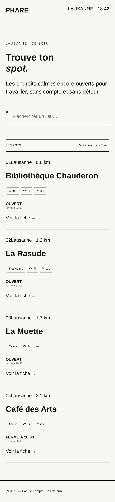
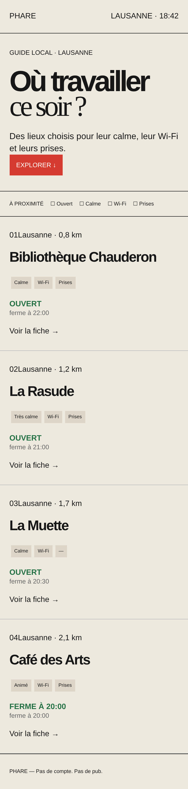
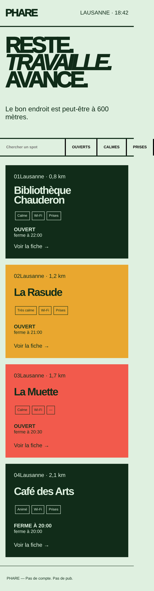

# Critique comparative · 3 propositions de design pour Phare

Les trois prototypes ([`01-minimal`](propositions/01-minimal), [`02-editorial`](propositions/02-editorial), [`03-bold`](propositions/03-bold)) sont évalués par rapport au [brief](../../brief.md), au [persona](persona.md) et au [user flow](user-flow.md). Ils ont été ouverts dans un navigateur à **390 px** (largeur de référence du brief) et à 1280 px.

À noter dès le départ : les trois versions partagent exactement le même `app.js` et le même `data.js`. Elles ne se distinguent que par le hero, la zone de recherche/filtres et le CSS. La comparaison porte donc surtout sur la direction visuelle et sur la façon dont chacune répond à Maya.

## Les trois propositions à 390 px

| 01 · Minimal | 02 · Éditorial | 03 · Bold |
|:---:|:---:|:---:|
|  |  |  |

---

## Verdict en bref

| | 01 · Minimal | 02 · Éditorial | 03 · Bold |
|---|:---:|:---:|:---:|
| Respect du brief | 2/5 | 3/5 | 3/5 |
| Réponse au persona (rapide, une main, infos visibles) | 3/5 | 3/5 | 2/5 |
| Hiérarchie et lisibilité | 3/5 | 4/5 | 3/5 |
| Identité visuelle / ambiance | 2/5 | 4/5 | 4/5 |
| Accessibilité (WCAG AA, clavier) | 3/5 | 2/5 | 3/5 |
| Mobile 390 px et qualité technique | 3/5 | 3/5 | 1/5 |
| **Total** | **16/30** | **19/30** | **16/30** |

**Proposition retenue : 02 · Éditorial**, à condition de corriger ses faux filtres et la couleur du statut. C'est la seule qui montre les quatre critères du user flow (ouvert, calme, Wi-Fi, prises) dès l'écran d'accueil, et c'est celle dont l'ambiance « guide local » colle le mieux au projet. Elle peut emprunter l'indicateur de mise à jour de Minimal et les vrais boutons de filtre de Bold (voir [Recommandation](#recommandation)).

---

## Comparatif factuel (mesuré à 390 × 844 px)

| Point | 01 · Minimal | 02 · Éditorial | 03 · Bold |
|---|---|---|---|
| Haut de la 1re carte | 511 px | **447 px** | 478 px |
| Hauteur totale de la page | 1691 px | 1628 px | 1710 px |
| Débordement horizontal | non | non | **oui (449 px pour 390)** |
| Recherche | oui | non | oui |
| Filtres | aucun | 4 critères, mais en texte (☐) | 3 boutons, sans Wi-Fi |
| Bouton principal « Filtrer » (brief) | absent | absent (« Explorer ↓ ») | absent |
| Éléments atteignables au clavier | 1 (recherche) | 1 (« Explorer », sans action) | 4 (recherche + 3 boutons, sans action) |
| Couleur du statut | noir gras | vert, **même pour « Ferme à 20:00 »** | dépend de la position de la carte |
| Info « mis à jour il y a… » | **oui** | non | non |
| Police externe | non | oui (Google Fonts, 2 familles) | non |
| Bug CSS visible | titre à 32 px (classe `.hero` absente du HTML) | logo non stylé (`.brand` au lieu de `.logo`) | lettres du titre qui se chevauchent, contrôles coupés |

### Contrastes (couleurs définies dans les CSS)

| Paire | Ratio | AA texte normal (4,5:1) |
|---|---:|:---:|
| Minimal · texte `#111` sur `#f7f7f4` | 17,6:1 | ✅ |
| Minimal · petit texte `#666` sur `#f7f7f4` | 5,4:1 | ✅ |
| Éditorial · texte `#171717` sur `#eee9df` | 14,8:1 | ✅ |
| Éditorial · bouton blanc sur `#d53b2f` | 4,7:1 | ✅ (juste) |
| Éditorial · statut vert `#237044` sur `#eee9df` | 5,0:1 | ✅ |
| Éditorial · petit texte `#666` sur `#eee9df` | 4,8:1 | ✅ (juste) |
| Bold · texte `#102d19` sur `#dff0df` | 12,5:1 | ✅ |
| Bold · carte jaune, texte `#102d19` sur `#e8a72f` | 7,1:1 | ✅ |
| Bold · carte corail, texte `#102d19` sur `#f25b4b` | 4,5:1 | ✅ (à la limite) |
| Bold · placeholder gris par défaut sur `#dff0df` | ≈ 3,9:1 | ❌ |

Les palettes passent globalement l'AA. Le problème d'accessibilité n'est pas la couleur mais la **taille** : les infos essentielles (calme, Wi-Fi, prises) sont en **10 px** dans les trois versions.

---

## 01 · Minimal

**Intention :** style suisse épuré, fond cassé, filets noirs, gros titre « Trouve ton *spot.* ».

**Points forts**
- La plus légère : pas de police externe, pas de couleur superflue. Bon point pour le forfait data limité de Maya.
- La seule à afficher **« Mis à jour il y a 2 min »**, qui répond directement à la crainte du persona (« informations d'ouverture dépassées »).
- Contrastes très confortables partout.
- Le pied de page « Pas de compte. Pas de pub. » reprend mot pour mot les attentes du persona (présent dans les trois versions).

**Points faibles**
- **Aucun filtre.** Le brief demande « Filtrer » comme bouton principal de l'écran 1 et le persona ferme l'onglet « si les filtres sont difficiles à trouver ». C'est l'écart le plus grave des trois propositions.
- Le grand titre prévu n'apparaît pas : le CSS cible `.hero h1`, mais aucun élément `.hero` n'existe dans le HTML. Le titre tombe à 32 px et la proposition perd son principal effet visuel.
- « 30 SPOTS » alors que seulement 4 lieux sont affichés.
- En desktop, la grille à 3 colonnes reçoit 5 éléments : la distance se retrouve à gauche, le nom à droite, le statut en dessous. L'ordre de lecture est cassé.
- L'icône de recherche « ⌕ » est minuscule et mal alignée avec le champ.

**Ressenti :** sobre mais impersonnel. Sans le grand titre, elle ressemble plus à une maquette fil de fer qu'à une direction artistique.

---

## 02 · Éditorial

**Intention :** magazine / guide local, fond crème, titre en grotesque serrée + italique serif (« Où travailler *ce soir ?* »), accent rouge.

**Points forts**
- **La seule qui affiche les 4 critères du user flow** (Ouvert, Calme, Wi-Fi, Prises) dès l'accueil, sur une ligne lisible.
- Première carte la plus haute de l'écran (447 px) : Maya voit un lieu plus vite qu'ailleurs.
- Statut « OUVERT » en vert : on le repère d'un coup d'œil.
- La direction la plus aboutie et la plus cohérente : la question du titre parle directement à Maya à 18 h, le ton « guide local » rassure sur la qualité de la sélection.
- Les étiquettes beiges (fond `#ddd5c8`) sont plus lisibles que les cadres fins des deux autres versions.

**Points faibles**
- **Les filtres sont faux** : ce sont des caractères « ☐ » dans du texte, pas des cases à cocher. Impossible de les toucher, de les atteindre au clavier, et un lecteur d'écran les lit comme du texte. Ils promettent une action qui n'existe pas.
- **« FERME À 20:00 » est affiché dans le même vert que « OUVERT ».** À 18:42, le Café des Arts est encore ouvert mais ferme dans 1 h 18, soit moins que les 1 h 30 dont Maya a besoin. Le vert envoie le mauvais signal. C'est exactement ce que le brief interdit (« pas de statuts ouverts sans information suffisamment claire »).
- Le bouton « EXPLORER ↓ » est le seul élément cliquable de la page et il ne fait rien. Il est aussi collé au texte (aucune marge).
- Le logo n'est pas stylé : le CSS définit `.brand`, le HTML utilise `.logo`.
- Google Fonts (DM Sans + Playfair Display) : deux requêtes externes et un chargement plus lourd, en contradiction avec le forfait data limité. Sans connexion, le titre perd son contraste typographique.
- Espacement des filtres fait avec des espaces idéographiques (`　`) au lieu de `gap` en CSS.

**Ressenti :** la proposition qui a le plus de caractère tout en restant calme, ce qui correspond au sujet (trouver un lieu *calme*). Les défauts sont réels mais tous corrigeables sans changer la direction.

---

## 03 · Bold

**Intention :** affiche, titre impératif « RESTE. *TRAVAILLE.* AVANCE. », cartes pleines en vert foncé, jaune et corail, filets épais de 3 px.

**Points forts**
- La plus mémorable et la plus énergique. Le slogan est fort et la phrase « Le bon endroit est peut-être à 600 mètres » est la meilleure accroche des trois.
- **Vrais éléments interactifs** : un champ de recherche et trois `<button>` atteignables au clavier, avec des zones de toucher confortables (≈ 49 px de haut).
- Les cartes pleines séparent bien les lieux et se lisent comme des blocs.

**Points faibles**
- **Débordement horizontal à 390 px** : la barre de contrôles mesure 449 px, le bouton « PRISES » est coupé et la page glisse sur le côté. Sur la largeur de référence du brief, c'est bloquant.
- **Couleurs des cartes attribuées par position** (`nth-child(2)` et `(3)`) et non par signification. La Muette, ouverte, apparaît en corail/rouge, ce qui se lit comme « fermé » ou « alerte ». Avec 30 lieux, seules les cartes 2 et 3 seraient colorées.
- Le filtre **Wi-Fi manque** alors que c'est un des 4 critères du user flow.
- Le hero prend beaucoup de place : en desktop, la première carte est sous la ligne de flottaison (843 px pour un écran de 800 px).
- `letter-spacing: -.1em` fait se chevaucher les lettres de « TRAVAILLE. ». `font-weight: 1000` n'existe pas en Arial (rendu en 700).
- Le ton impératif (« RESTE. TRAVAILLE. ») est plus « motivation sportive » que « lieu calme ». Il crée une tension avec le besoin principal de Maya.

**Ressenti :** visuellement la plus forte, mais elle sert l'affiche plus que l'utilisatrice. Elle serait plus adaptée à une campagne de lancement qu'à l'outil du quotidien.

---

## Problèmes communs aux trois propositions

Ces points sont à corriger quelle que soit la version retenue.

1. **Seul l'écran 1 existe.** Le brief demande 4 écrans (liste, recherche/filtrage, fiche détaillée, itinéraire). Les écrans 2, 3 et 4 manquent, ainsi que la variante d'échec « aucun résultat ».
2. **« Voir la fiche → » est une `
`**, pas un lien : impossible de cliquer, de taper ou d'y accéder au clavier. Le parcours s'arrête à l'écran 1.
3. **Statut ambigu pour le Café des Arts** : « FERME À 20:00 » en gros, puis « ferme à 20:00 » en petit. L'information est dupliquée et ne dit pas si le lieu est ouvert. Proposition : afficher **« Ouvert · encore 1 h 18 »**, ce qui permet à Maya de comparer directement avec ses 1 h 30.
4. **Les infos essentielles sont les plus petites de la page** (étiquettes en 10 px, statut en 11 à 15 px), alors que le persona veut voir ouvert/fermé, son, Wi-Fi et prises en priorité. La hiérarchie est inversée : le nom du lieu est énorme, les critères de décision minuscules.
5. **Prises absentes affichées par un simple tiret** (La Muette). Peu clair visuellement et muet pour un lecteur d'écran : écrire « Sans prises ».
6. **Champs sans `<label>`** : seul le placeholder décrit la recherche, ce qui ne suffit pas pour WCAG.
7. **Boutons de filtre sans état** : pas de `aria-pressed` ni de style actif/inactif.
8. **« 01Lausanne »** collé : le bloc `.top` n'est stylé dans aucune version.
9. **Heure « 18:42 » écrite en dur** dans le header.
10. **Pas de variables CSS** alors que le brief les exige, et CSS écrit desktop d'abord (`max-width`) au lieu de **mobile first** (`min-width`).
11. **Usage à une main** : la recherche et les filtres sont en haut de l'écran, loin du pouce. Un bouton « Filtrer » fixé en bas de l'écran répondrait mieux au fait n° 1 du persona.
12. **Aucun style de focus personnalisé** : la navigation clavier repose sur le contour par défaut du navigateur.

---

## Recommandation

Partir de **02 · Éditorial** et lui ajouter :

| À garder | Vient de |
|---|---|
| Titre question, fond crème, statut en couleur, étiquettes à fond plein | Éditorial |
| « Mis à jour il y a X min » sous la liste | Minimal |
| Champ de recherche | Minimal / Bold |
| Vrais boutons de filtre (avec `aria-pressed`), zones de toucher ≥ 44 px | Bold |
| Accroche « Le bon endroit est peut-être à 600 mètres » (en sous-titre) | Bold |

Et changer :

- statut en **3 états de couleur** : ouvert (vert), ferme bientôt / moins de 1 h 30 (orange), fermé (rouge ou gris), toujours accompagnés d'un texte, jamais la couleur seule ;
- étiquettes son / Wi-Fi / prises en **14 px minimum**, avec une icône ;
- une seule police externe au maximum (ou police système pour le texte courant et serif uniquement pour le titre) ;
- carte entière cliquable (`<a>` qui enveloppe la carte) vers la fiche.

---

## Checklist avant de passer au code

- [ ] Choix de la direction validé (Éditorial)
- [ ] Palette passée en variables CSS (`--fond`, `--texte`, `--accent`, `--ok`, `--attention`, `--ferme`)
- [ ] CSS réécrit en mobile first (`min-width`)
- [ ] Vrais `<input type="checkbox">` ou `<button aria-pressed>` pour les filtres
- [ ] `<label>` sur la recherche
- [ ] Bouton principal « Filtrer » présent (brief)
- [ ] Statut avec temps restant (« encore 1 h 18 »)
- [ ] Carte cliquable vers la fiche
- [ ] Écran 2 · Recherche et filtrage
- [ ] Écran 3 · Fiche détaillée
- [ ] Écran 4 · Itinéraire
- [ ] État « aucun résultat » avec bouton pour retirer des filtres
- [ ] Test à 390 px sans débordement horizontal
- [ ] Test complet au clavier (Tab, Entrée, Espace) avec focus visible
