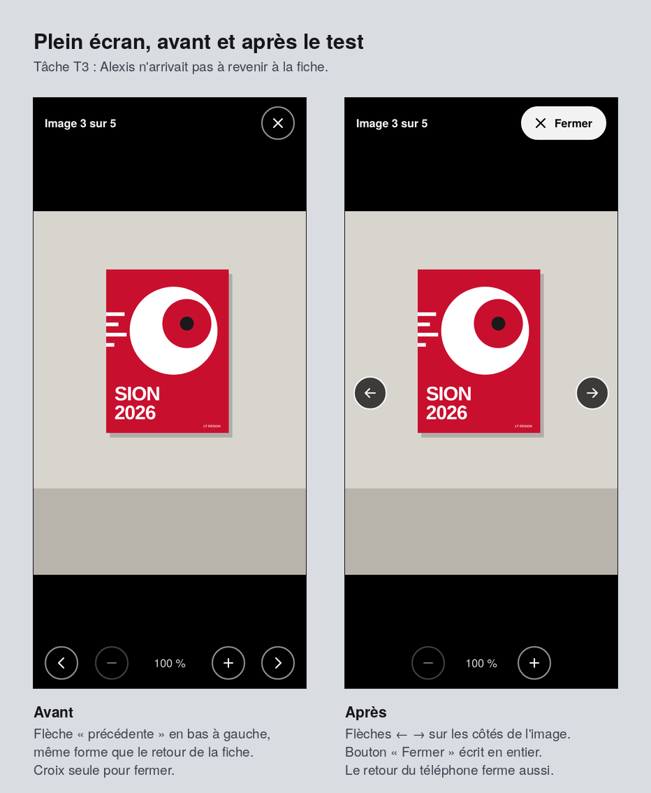

# Tests utilisateurs et accessibilité · LT-design app

**Prototype testé :** proposition retenue [01 · Nuit](propositions/01-nuit/) (voir la [critique](critique.md))  
**Référence :** WCAG 2.2, niveau AA  
**Vérification de l'accessibilité :** 9 octobre 2026  
**Test utilisateur :** réalisé le 9 octobre 2026 avec Alexis (SM-C3b), sur téléphone (parties 2 à 4)

---

## Partie 1 · Vérification de l'accessibilité

### Méthode

- Prototype ouvert dans Chromium à 390 × 844 px et parcouru écran par écran : notification, fiche, plein écran, fiche avec favori, accueil, favoris vides, page d'erreur.
- **Contrastes :** calculés sur les couleurs réellement affichées par le navigateur (texte et fond), avec la formule WCAG, la même que le WebAIM Contrast Checker. Au total, 92 textes ont été contrôlés.
- **Clavier :** parcours complet du user flow sans souris (Tab, Maj+Tab, Entrée, Espace, flèches, Échap), puis vérification sur captures d'écran.
- **Focus masqué (2.4.11) :** pour chaque élément qui reçoit le focus, on vérifie en 25 points ce qui est réellement dessiné au-dessus de lui.

### 1.1 Contraste du texte (1.4.3, minimum 4,5:1)

| Texte | Couleur | Fond | Ratio | Résultat |
|---|---|---|---:|:---:|
| Texte principal : titres, description, dates | `#F2F4F7` | `#0F1115` | 17,15:1 | ✅ |
| Texte secondaire : catégorie, date courte, nombre de sorties | `#A7AFBA` | `#0F1115` | 8,53:1 | ✅ |
| Bouton « Ajouter aux favoris », badge « Nouveau », lien « Aller au contenu » | `#0F1115` | `#189CD8` | 6,11:1 | ✅ |
| Filtre actif, message « Ajoutée à tes favoris » | `#0F1115` | `#F2F4F7` | 17,15:1 | ✅ |
| Plein écran : « Image 3 sur 5 » | `#F2F2F2` | `#000000` | 18,76:1 | ✅ |
| Plein écran : niveau de zoom « 100 % » | `#D0D0D0` | `#000000` | 13,62:1 | ✅ |
| Plein écran : bouton « Fermer » (ajouté après le test) | `#000000` | `#F2F2F2` | 18,76:1 | ✅ |

**Résultat : 92 textes contrôlés, 0 échec, contraste minimum de 6,11:1.**

Le bleu LT Design `#189CD8` porte toujours du texte foncé : du blanc sur ce bleu ne donnerait que 3,09:1 et ne passerait pas l'AA. Cette règle est notée dans le [brief](../../brief.md).

### 1.2 Contraste des éléments d'interface (1.4.11, minimum 3:1)

| Élément | Couleur | Fond | Ratio | Résultat |
|---|---|---|---:|:---:|
| Contour de focus | `#189CD8` | `#0F1115` | 6,11:1 | ✅ |
| Contour de focus sur une surface (`#16191F`) | `#189CD8` | `#16191F` | 5,69:1 | ✅ |
| Cœur rempli d'une sortie en favori | `#189CD8` | `#0F1115` | 6,11:1 | ✅ |
| Icône Partager | `#F2F4F7` | `#0F1115` | 17,15:1 | ✅ |
| Filtre actif par rapport au fond | `#F2F4F7` | `#0F1115` | 17,15:1 | ✅ |
| Bord des filtres et du bouton Partager | `#2C313B`, puis `#6B7480` | `#0F1115` | 1,45:1, puis 3,99:1 | ⚠️ puis ✅ |
| Boutons du plein écran | `#8C8C8C` | `#000000` | 6,25:1 | ✅ |
| Contour de focus en plein écran | `#FFFFFF` | `#000000` | 21:1 | ✅ |
| Flèches ← → sur l'image, pire cas sur une image claire (ajoutées après le test) | `#F2F2F2` | `#3C3C3A` | 9,88:1 | ✅ |

### 1.3 Navigation complète au clavier, sans souris (2.1.1, 2.1.2, 2.4.3, 2.4.7)

| # | Action | Touche | Résultat attendu | Résultat |
|---|---|---|---|:---:|
| 1 | Atteindre la notification sur l'écran verrouillé | Tab | Le focus est sur la notification | ✅ |
| 2 | Ouvrir la notification | Entrée | La fiche « Affiche FC Sion 2026 » s'ouvre directement | ✅ |
| 3 | Premier Tab dans l'app | Tab | Le lien « Aller au contenu » apparaît | ✅ |
| 4 | Parcourir la fiche | Tab (12 fois) | Ordre : Aller au contenu, logo, Favoris, Dernières sorties, Agrandir le visuel, 5 images de la galerie, Ajouter aux favoris, Partager | ✅ |
| 5 | Voir où l'on est | (aucune) | Contour bleu de 3 px sur les 12 éléments | ✅ |
| 6 | Ouvrir une image de la galerie | Entrée | Plein écran ouvert, focus sur « Fermer » | ✅ |
| 7 | Passer à l'image suivante | Flèche droite | « Image 3 sur 5 » devient « Image 4 sur 5 » | ✅ |
| 8 | Rester dans le plein écran | Tab | Le focus tourne dans le plein écran sans passer derrière | ✅ |
| 9 | Zoomer | Entrée sur « Zoomer » | 100 % devient 150 % | ✅ |
| 10 | Fermer le plein écran | Échap | Plein écran fermé, focus revenu sur l'image ouverte | ✅ |
| 11 | Ajouter aux favoris | Entrée | Le bouton devient « Retirer des favoris », le message « Ajoutée à tes favoris » est annoncé | ✅ |
| 12 | Revenir à l'accueil | Entrée sur « Dernières sorties » | Accueil affiché, focus sur le titre « Dernières sorties » | ✅ |
| 13 | Voir que la sortie est vue | (aucune) | Badge « Nouveau » visible au retour, puis retiré | ✅ |
| 14 | Filtrer les affiches | Espace sur « Affiches » | Filtre activé, « 2 sorties » annoncé | ✅ |
| 15 | Voir ses favoris | Entrée sur « Favoris » | La sortie ajoutée est dans la liste | ✅ |

**Résultat : tout le user flow se fait sans souris, sans piège au clavier (Échap ferme toujours le plein écran).**

### 1.4 Nouveaux critères de WCAG 2.2 et autres vérifications

| Critère | Vérification | Résultat |
|---|---|:---:|
| **2.4.11 Focus non masqué** (nouveau en 2.2) | La barre du haut et la barre d'actions sont fixes. Sans protection, en remontant l'accueil avec Maj+Tab, 20 % du lien qui a le focus est caché par la barre du haut. Avec le `scroll-padding` de `base.css` : 0 % sur tous les éléments. | ✅ |
| **2.5.8 Taille des cibles** (nouveau en 2.2) | Il faut au moins 24 × 24 px. La plus petite cible du prototype mesure 44 px, comme le demande le brief. | ✅ |
| **2.5.7 Mouvements de glissement** (nouveau en 2.2) | Glisser pour changer d'image a une alternative en un seul geste : les boutons précédent et suivant. | ✅ |
| **3.3.8 Authentification accessible** (nouveau en 2.2) | Pas de compte ni de mot de passe. | non concerné |
| **3.3.7 Saisie redondante** (nouveau en 2.2) | Aucun formulaire. | non concerné |
| **3.2.6 Aide cohérente** (nouveau en 2.2) | Pas de rubrique d'aide dans le prototype. | non concerné |
| 1.1.1 Contenu non textuel | Chaque visuel a un texte alternatif ou un bouton nommé (« Agrandir le visuel : grand cercle blanc en mouvement… »). Les icônes décoratives sont masquées (`aria-hidden`). | ✅ |
| 1.3.1 Information et relations | Un `h1` par écran, `h2` « Galerie », liste ordonnée des sorties, liste de définitions pour les infos, zones `header`, `main` et `nav`. | ✅ |
| 1.3.4 Orientation | En paysage (844 × 390), tout s'affiche et les boutons du plein écran restent visibles. | ✅ |
| 1.4.4 Redimensionnement du texte | Le zoom du navigateur et le pincement ne sont pas bloqués. | ✅ |
| 1.4.10 Redistribution | À 320 px de large : aucun défilement horizontal, sur l'accueil comme sur la fiche. | ✅ |
| 2.4.1 Contourner des blocs | Lien « Aller au contenu » en premier. | ✅ |
| 2.5.1 Gestes du pointeur | Aucun geste à plusieurs doigts obligatoire : le zoom passe par des boutons. | ✅ |
| 4.1.2 Nom, rôle et valeur | Aucun bouton sans nom ; filtres avec `aria-pressed` ; lien Favoris avec `aria-current`. | ✅ |
| 4.1.3 Messages d'état | « Ajoutée à tes favoris », « Lien copié » et le nombre de sorties sont annoncés (`role="status"`, `aria-live`). | ✅ |
| Animations réduites | Avec l'option « réduire les animations » du téléphone, les transitions sont coupées. | ✅ |
| Lecteur d'écran | Pas encore testé (VoiceOver ou TalkBack). | ⬜ à faire |

### 1.5 Problèmes trouvés et actions correctives

| # | Problème | Critère | Action corrective | Statut |
|---|---|---|---|:---:|
| 1 | Bords des filtres et du bouton Partager presque invisibles (1,45:1). Le texte et l'icône identifient déjà les boutons, mais on voit mal où toucher. | 1.4.11 | Nouvelle variable `--contour: #6B7480` (3,99:1) dans `01-nuit/style.css` | ✅ corrigé |
| 2 | Le message « Ajoutée à tes favoris » restait affiché après le retour à l'accueil, par-dessus la sortie à la une. | 4.1.3, lisibilité | Le message est effacé à chaque changement d'écran (`app.js`, fonction `router`) | ✅ corrigé |
| 3 | En remontant avec Maj+Tab, la barre du haut peut cacher l'élément qui a le focus (20 % masqué sans protection). | 2.4.11 | `scroll-padding-top` et `scroll-padding-bottom` dans `base.css`, vérifié à 0 % | ✅ vérifié |
| 4 | Du texte blanc sur le bleu LT ne donne que 3,09:1. | 1.4.3 | Texte foncé `#0F1115` sur le bleu (6,11:1), règle ajoutée au brief | ✅ appliqué |
| 5 | Lecteur d'écran pas encore testé. | 4.1.2 | Refaire les tâches du scénario ci-dessous avec VoiceOver (iPhone) ou TalkBack (Android) | ⬜ à faire |

---

## Partie 2 · Scénario de test utilisateur

### Objectif

Vérifier qu'une personne qui ne connaît pas l'app peut aller seule de la notification jusqu'à la sortie en favori, et repérer ce qui la fait hésiter.

### Participant

- Un ou une camarade de classe qui n'a pas encore vu le prototype.
- Si possible proche de Benjamin (voir le [persona](persona.md)) : intéressé par le graphisme ou le sport, et qui suit des créateurs sur Instagram.

### Matériel

- Un smartphone de préférence, sinon un ordinateur avec la vue mobile à 390 px des outils de développement.
- Le prototype ouvert sur `application/Design/propositions/01-nuit/notification.html`. Le lien de la notification remet le prototype à zéro à chaque nouveau test.
- Pour l'ouvrir sur un téléphone : activer GitHub Pages sur le dépôt (Settings, Pages, branche `main`), puis ouvrir `https://leoleoleleo.github.io/m921-leo/application/Design/propositions/01-nuit/notification.html`.
- Ce fichier, ouvert ou imprimé, pour noter. Un chronomètre.
- Durée : 10 à 15 minutes.

### Rôle de l'observateur

- Lire la consigne, puis ne plus aider. Si le participant demande de l'aide, répondre : « Fais comme tu ferais chez toi. »
- Lui demander de penser à voix haute.
- Noter ce qu'il fait et ce qu'il dit, ses hésitations (plus de 5 secondes sans agir), ses erreurs et ses phrases exactes.
- Ne pas expliquer ni défendre le design pendant le test.

### Consigne lue au participant

> « C'est l'app que je teste, pas toi : il n'y a pas de mauvaise réponse. Imagine que tu es fan d'un graphiste, LT Design, et que tu reçois cette notification sur ton téléphone. Pendant les tâches, dis à voix haute ce que tu penses et ce que tu cherches. »

### Tâches

| # | Tâche lue au participant | Réussie si… | À observer |
|---|---|---|---|
| T1 | « Tu viens de recevoir cette notification. Ouvre la nouvelle sortie. » | La fiche « Affiche FC Sion 2026 » s'ouvre | Touche-t-il la notification tout de suite ? Comprend-il qu'il est sur la bonne sortie ? |
| T2 | « Regarde l'affiche de près, avec le plus de détails possible. » | Ouvre une image en plein écran et zoome | Voit-il que le visuel se touche ? Utilise-t-il les boutons de zoom ou essaie-t-il de pincer ? |
| T3 | « Regarde une autre image du projet, puis reviens à la fiche. » | Change d'image, puis ferme le plein écran | Flèches, glissement ou galerie ? Trouve-t-il « Fermer » ? |
| T4 | « Tu aimes ce projet : garde-le pour le retrouver plus tard. » | Touche « Ajouter aux favoris » | Remarque-t-il le changement (cœur rempli, message) ? |
| T5 | « Tu voudrais l'envoyer à un ami. » | Touche le bouton Partager | Reconnaît-il l'icône, qui n'a pas de texte ? |
| T6 | « Va voir les autres sorties de LT Design. » | Arrive sur « Dernières sorties » | Lien retour ou logo ? Remarque-t-il le badge « Nouveau » qui disparaît ? |
| T7 | « Montre-moi seulement les identités visuelles. » | Active le filtre « Identités » | Trouve-t-il les filtres ? Comprend-il lequel est actif ? |
| T8 | « Retrouve le projet que tu as gardé tout à l'heure. » | Ouvre « Favoris » et y trouve l'affiche FC Sion | Comprend-il le lien « Favoris » en haut à droite ? |

### Questions après le test

1. De 1 (très difficile) à 5 (très facile), comment c'était ? Pourquoi ?
2. Qu'est-ce qui t'a fait hésiter ou t'a surpris ?
3. Qu'est-ce que tu as le plus aimé ?
4. Est-ce que tu installerais cette app si tu suivais LT Design ? Pourquoi ?
5. Quelle est la première chose que tu changerais ?

---

## Partie 3 · Observations

Notes prises avec la fiche de test pendant le test, recopiées telles quelles (orthographe corrigée).

**Participant :** Alexis  
**Classe :** SM-C3b  
**Date :** 9 octobre 2026, de 11 h 32 à 11 h 37 (environ 5 minutes)  
**Appareil :** téléphone

| Tâche | Réussie ? | Temps | Chemin suivi, hésitations, erreurs | Phrase du participant |
|---|:---:|---:|---|---|
| T1 Ouvrir la sortie | ✅ Oui | 0:05 | A touché la notification. | « C'est instinctif. » |
| T2 Voir l'affiche de près | ✅ Oui | 0:04 | A touché l'image. | |
| T3 Autre image, puis retour | ⚠️ Avec aide | 0:08 | A touché, mais n'a pas réussi à revenir à la fiche. | |
| T4 Garder en favori | ✅ Oui | 0:02 | Rien de noté. | |
| T5 Partager | ✅ Oui | 0:03 | Rien de noté. | |
| T6 Voir les autres sorties | Pas noté | 0:04 | A touché le logo « LT Design » pour revenir à l'accueil. | |
| T7 Filtrer les identités | Pas noté | 0:34 | Rien de noté. C'est la tâche la plus longue : 4 à 17 fois plus que les autres. | |
| T8 Retrouver le favori | ✅ Oui | 0:02 | Rien de noté. | |

**Bilan :** 5 tâches réussies seul (T1, T2, T4, T5, T8), 1 avec aide (T3), 2 sans résultat noté (T6, T7). Temps total des tâches : 1 min 02 s.

**Réponses aux questions**

1. Facilité : **4/5**. Pourquoi : « C'est bien. »
2. Hésitations ou surprises : « Les flèches. »
3. Ce qu'il a le plus aimé : « Le logo. »
4. Installerait l'app ? : « Oui, j'aime LT Design. »
5. Première chose à changer : pas de réponse.

**Ce qu'on retient**

- Le début du flow fonctionne : la notification ouvre la fiche et le plein écran s'ouvre en 4 à 5 secondes. Alexis le trouve « instinctif ».
- Le point faible est la sortie du plein écran (T3), et sa réponse « les flèches » va dans le même sens.
- Le logo plaît et sert aussi de chemin vers l'accueil.

**Limites de ce test**

- Un seul participant : les résultats donnent des pistes, pas des certitudes.
- Sur la fiche, les cases « n'a jamais vu le prototype » et « penser à voix haute » ne sont pas cochées. On ne sait donc pas s'il découvrait le prototype, et peu de phrases ont été notées.
- T6 et T7 n'ont pas de résultat noté. Pour T7, le chrono a peut-être continué pendant la prise de notes.

---

## Partie 4 · Actions correctives après le test

Gravité : **bloquant** (tâche pas terminée seul), **gênant** (terminée avec une erreur ou une longue hésitation), **mineur** (simple remarque).

| # | Observation | Tâche | Gravité | Action corrective | Fichiers modifiés | Statut |
|---|---|---|---|---|---|:---:|
| 1 | N'a pas réussi à revenir du plein écran à la fiche sans aide, et cite « les flèches » comme ce qui l'a fait hésiter. Causes probables : la flèche « image précédente », en bas à gauche, avait exactement la même forme que la flèche de retour de la fiche ; la croix pour fermer n'avait pas de texte ; le bouton retour du téléphone quittait la fiche au lieu de fermer l'image. | T3 | Bloquant | Flèches ← → placées sur les côtés de l'image, avec une autre forme que le retour. Bouton « Fermer » écrit en entier. Le bouton retour du téléphone ferme maintenant le plein écran. | `commun/app.js`, `commun/base.css`, `index.html` des 3 propositions (elles partagent le plein écran) | ✅ corrigé |
| 2 | En vérifiant la correction n° 1, les nouvelles flèches étaient presque invisibles sur une image claire : une règle CSS écrasait leur fond sombre. | T3 | Gênant | Fond noir à 72 % et bord clair : l'icône est à 9,88:1 dans le pire cas. | `commun/base.css` | ✅ corrigé |
| 3 | 34 secondes pour filtrer les identités, sans résultat ni chemin noté. | T7 | À confirmer | Refaire T7 avec un 2e camarade, en notant le chemin et le résultat, avant de modifier les filtres. | aucun pour l'instant | ⬜ à faire |
| 4 | A utilisé le logo pour revenir à l'accueil. | T6 | Positif | Rien à changer : le logo mène déjà aux dernières sorties. | aucun | ✅ |
| 5 | A aimé le logo et installerait l'app (« Oui, j'aime LT Design »). | Questions | Positif | Garder le logo et la direction Nuit. | aucun | ✅ |
| 6 | Préparation incomplète : cases non cochées, T6 et T7 sans résultat noté. | Méthode | Mineur | Au prochain test : cocher la préparation, demander de penser à voix haute, noter un résultat pour chaque tâche. | fiche de test | ⬜ prochain test |

### Vérification des corrections

| Vérification | Résultat |
|---|:---:|
| Bouton retour du téléphone avec le plein écran ouvert : le plein écran se ferme et la fiche reste affichée | ✅ |
| Bouton « Fermer », puis retour du téléphone : on revient à la notification, sans étape en trop | ✅ |
| Flèche → touchée : « Image 3 sur 5 » devient « Image 4 sur 5 » | ✅ |
| Flèches visibles sur une image claire : icône à 9,88:1 (minimum 3:1) | ✅ |
| Audit refait sur les 3 propositions : 0 échec de contraste, 16 étapes clavier sur 16, cibles d'au moins 44 px | ✅ |

