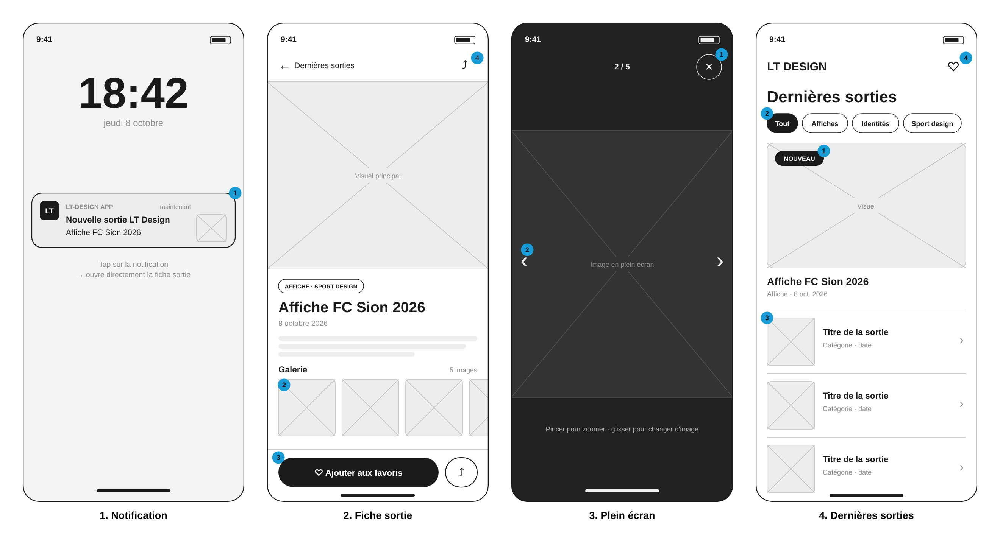
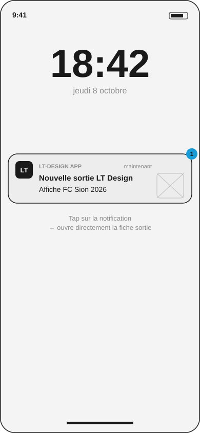
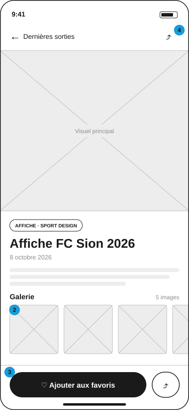
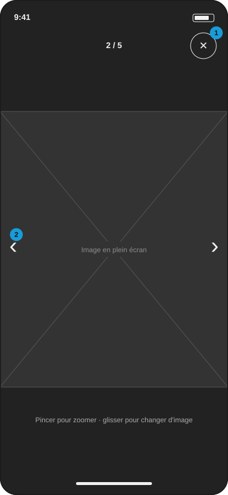
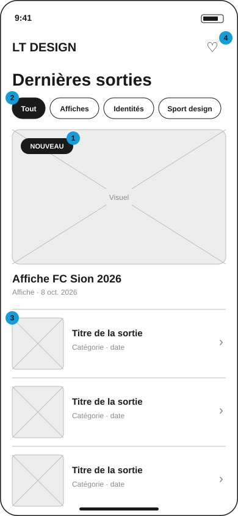

# Wireframes · LT-design app

Wireframes basse fidélité des 4 écrans du [user flow](../user-flow.md), à la largeur de référence de 390 px. Les pastilles bleues numérotées renvoient aux annotations ci-dessous.

## 1 · Notification

1. La notification affiche le nom de l'app, « Nouvelle sortie LT Design », le titre du projet et une vignette. Un tap ouvre **directement la fiche** de la sortie, pas l'accueil.

## 2 · Fiche sortie

1. Visuel principal en grand, en haut de l'écran : c'est la première chose que Benjamin voit après la notification.
2. Galerie défilante à l'horizontale. Un tap sur une image ouvre le plein écran.
3. Barre d'actions fixée en bas, dans la zone du pouce : « Ajouter aux favoris » (bouton principal) et partager.
4. Partage aussi accessible en haut, et retour vers « Dernières sorties » à gauche.

## 3 · Image en plein écran

1. Bouton « Fermer » de 44 px, avec la position de l'image (2 / 5) au centre.
2. Flèches précédent / suivant, en plus du glissement et du zoom au pincement.

## 4 · Accueil « Dernières sorties »

1. La sortie la plus récente est mise en avant, avec le badge « Nouveau » tant qu'elle n'a pas été vue.
2. Filtres par catégorie : Tout, Affiches, Identités, Sport design.
3. Les sorties précédentes en liste : vignette, titre, catégorie et date.
4. Accès aux favoris.
